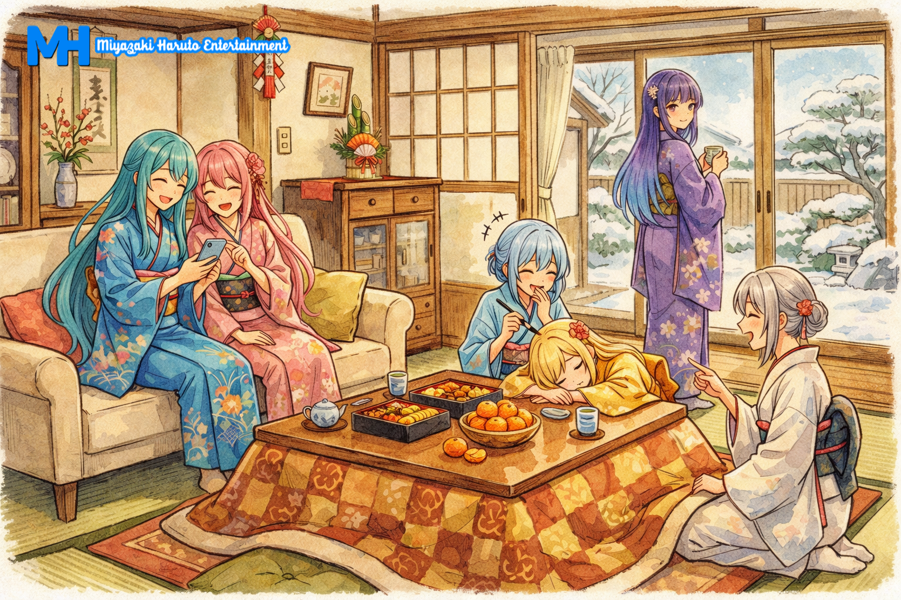

# 🎬 MHEnt. Universe
**Hệ thống đa vũ trụ giải trí phi lợi nhuận của Miyazaki Haruto Entertainment Co., Ltd.**

## 🌟 Về dự án
Khởi nguồn từ một dự án nhỏ mang tên **MHEnt. Cinema** với niềm đam mê cháy bỏng dành cho văn hóa 2D (Anime, Tokusatsu) và đặc biệt là vũ trụ *Pretty Cure*, chúng tớ đã không ngừng nỗ lực để vươn mình thành một Hệ sinh thái giải trí toàn diện.

Mục tiêu lớn nhất của MHEnt. là kiến tạo một không gian kết nối không giới hạn — nơi bạn có thể đắm chìm vào những bộ phim chất lượng, những trang truyện cuốn hút, những áng văn bay bổng và những giai điệu chữa lành. Tất cả đều được vận hành bởi sự nhiệt huyết và **hoàn toàn phi lợi nhuận** dành cho cộng đồng.

## 🚀 Các phân khu đang hoạt động
Hiện tại, MHEnt Universe đang mở cửa đón khách ở các vũ trụ sau:

* 🍿 **MHEnt. Cinema (Rạp chiếu phim Tân Thời):** Nơi lưu trữ các dự án Vietsub độc quyền.
  * *Star Detective Pretty Cure!* (Series)
  * *Eiga Kimi to Idol Pretty Cure♪* (Movie)
* ⚔️ **MHEnt. Arena:** Không gian thách đấu trí tuệ và trắc nghiệm (Quiz).

## 🛠️ Công nghệ cốt lõi
Hệ thống được phát triển hoàn toàn thủ công (Vanilla) để đảm bảo tốc độ và sự tối ưu:
* **Frontend:** HTML5 / CSS3 / Vanilla JavaScript
* **Backend / Database:** Firebase (Authentication, Firestore, Realtime Database, Storage)
* **Hosting:** Vercel (Web) & GitHub (Source Code)

## 🌐 Kết nối với chúng tớ
Đừng quên ghé thăm và giao lưu với các cư dân của đa vũ trụ MHEnt nhé:
* [Fanpage Chính Thức](https://www.facebook.com/mharuto.entertainment/)
* [Cộng đồng Rạp Phim (Facebook Group)](https://www.facebook.com/groups/mhent.cinema)

## 📜 Lưu ý pháp lý
👉 Vui lòng đọc kĩ **[Điều Khoản Sử Dụng (ToS)](https://mhentuniverse.vercel.app/terms)** và **Nguyên Tắc Cộng Đồng** trước khi trải nghiệm dịch vụ. Bằng việc truy cập vào MHEnt Universe, bạn đồng ý tuân thủ các quy định mà chúng tớ đã đề ra. Mọi hành vi vi phạm sẽ được xử lý theo đúng điều khoản.

---
*Cảm ơn bạn đã ghé thăm và ủng hộ dự án!* 💖
©2026 Miyazaki Haruto Entertainment Co., Ltd.